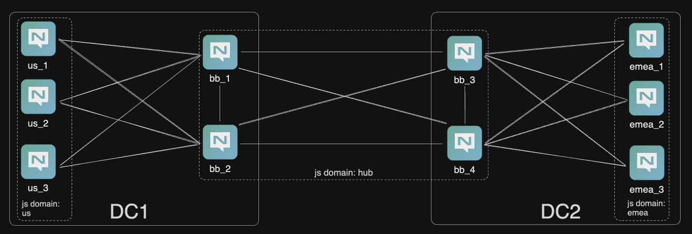

# What is this?

This test environment is 'interesting' for several reasons.
1.  This is a two data center model.
2.  There is a backbone for connectivity, spanning both data centers. JetStream is enabled. It can be used for 'connectivity', but you shall see you can also run streams etc on the backbone and we go through the motions of removing an active node (both leader and non-leader) and adding a non stream-peered node to the stream cluster.
3.  A three node leaf-node cluster in each data center for JS enabled activities.



### Setup.

For ease and simplicity, I start all nodes in `Kitty` and leave them running in the foreground.

```bash
nats-server -c backbone_emea_1.conf
nats-server -c backbone_emea_2.conf
nats-server -c backbone_us_1.conf
nats-server -c backbone_us_2.con

nats-server -c spoke_us_1.conf
nats-server -c spoke_us_2.conf
nats-server -c spoke_us_3.conf

nats-server -c spoke_emea_1.conf
nats-server -c spoke_emea_2.conf
nats-server -c spoke_emea_3.conf
```

Don't forget to set two contexts up, one for `acc1` and one for `admin`, which is the SYS account. I've called mine `local` and `local:admin` and will use them in this document.

### Validate

The backbone and two leaf-node clusters will come up and each cluster will elect their own meta leader.

```bash
nats context select local:admin

nats server report jetstream --js-domain="hub"
╭────────────────────────────────────────────────────────────────────────────────────────────────────────────╮
│                                              JetStream Summary                                             │
├────────────┬─────────┬────────┬─────────┬───────────┬──────────┬───────┬────────┬──────┬─────────┬─────────┤
│ Server     │ Cluster │ Domain │ Streams │ Consumers │ Messages │ Bytes │ Memory │ File │ API Req │ API Err │
├────────────┼─────────┼────────┼─────────┼───────────┼──────────┼───────┼────────┼──────┼─────────┼─────────┤
│ bb_emea_1* │ BB      │ hub    │ 0       │ 0         │ 0        │ 0 B   │ 0 B    │ 0 B  │ 0       │ 0       │
│ bb_emea_2  │ BB      │ hub    │ 0       │ 0         │ 0        │ 0 B   │ 0 B    │ 0 B  │ 0       │ 0       │
│ bb_us_1    │ BB      │ hub    │ 0       │ 0         │ 0        │ 0 B   │ 0 B    │ 0 B  │ 0       │ 0       │
│ bb_us_2    │ BB      │ hub    │ 0       │ 0         │ 0        │ 0 B   │ 0 B    │ 0 B  │ 0       │ 0       │
├────────────┼─────────┼────────┼─────────┼───────────┼──────────┼───────┼────────┼──────┼─────────┼─────────┤
│            │         │        │ 0       │ 0         │ 0        │ 0 B   │ 0 B    │ 0 B  │ 0       │ 0       │
╰────────────┴─────────┴────────┴─────────┴───────────┴──────────┴───────┴────────┴──────┴─────────┴─────────╯

╭─────────────────────────────────────────────────────────────────╮
│                   RAFT Meta Group Information                   │
├───────────┬──────────┬────────┬─────────┬────────┬────────┬─────┤
│ Name      │ ID       │ Leader │ Current │ Online │ Active │ Lag │
├───────────┼──────────┼────────┼─────────┼────────┼────────┼─────┤
│ bb_emea_1 │ dpWycHCd │ yes    │ true    │ true   │ 0s     │ 0   │
│ bb_emea_2 │ eeHm2tFr │        │ true    │ true   │ 628ms  │ 0   │
│ bb_us_1   │ v97Z4oCo │        │ true    │ true   │ 628ms  │ 0   │
│ bb_us_2   │ 7tE5VGdo │        │ true    │ true   │ 628ms  │ 0   │
╰───────────┴──────────┴────────┴─────────┴────────┴────────┴─────╯

nats server report jetstream --js-domain="us" 
╭────────────────────────────────────────────────────────────────────────────────────────────────────────╮
│                                            JetStream Summary                                           │
├────────┬─────────┬────────┬─────────┬───────────┬──────────┬───────┬────────┬──────┬─────────┬─────────┤
│ Server │ Cluster │ Domain │ Streams │ Consumers │ Messages │ Bytes │ Memory │ File │ API Req │ API Err │
├────────┼─────────┼────────┼─────────┼───────────┼──────────┼───────┼────────┼──────┼─────────┼─────────┤
│ us_1   │ US      │ us     │ 0       │ 0         │ 0        │ 0 B   │ 0 B    │ 0 B  │ 0       │ 0       │
│ us_2*  │ US      │ us     │ 0       │ 0         │ 0        │ 0 B   │ 0 B    │ 0 B  │ 0       │ 0       │
│ us_3   │ US      │ us     │ 0       │ 0         │ 0        │ 0 B   │ 0 B    │ 0 B  │ 0       │ 0       │
├────────┼─────────┼────────┼─────────┼───────────┼──────────┼───────┼────────┼──────┼─────────┼─────────┤
│        │         │        │ 0       │ 0         │ 0        │ 0 B   │ 0 B    │ 0 B  │ 0       │ 0       │
╰────────┴─────────┴────────┴─────────┴───────────┴──────────┴───────┴────────┴──────┴─────────┴─────────╯

╭────────────────────────────────────────────────────────────╮
│                 RAFT Meta Group Information                │
├──────┬──────────┬────────┬─────────┬────────┬────────┬─────┤
│ Name │ ID       │ Leader │ Current │ Online │ Active │ Lag │
├──────┼──────────┼────────┼─────────┼────────┼────────┼─────┤
│ us_1 │ ydtgUGB6 │        │ true    │ true   │ 862ms  │ 0   │
│ us_2 │ 43PYYJ4C │ yes    │ true    │ true   │ 0s     │ 0   │
│ us_3 │ 9uBucVqO │        │ true    │ true   │ 862ms  │ 0   │
╰──────┴──────────┴────────┴─────────┴────────┴────────┴─────╯

nats server report jetstream --js-domain="emea"
╭─────────────────────────────────────────────────────────────────────────────────────────────────────────╮
│                                            JetStream Summary                                            │
├─────────┬─────────┬────────┬─────────┬───────────┬──────────┬───────┬────────┬──────┬─────────┬─────────┤
│ Server  │ Cluster │ Domain │ Streams │ Consumers │ Messages │ Bytes │ Memory │ File │ API Req │ API Err │
├─────────┼─────────┼────────┼─────────┼───────────┼──────────┼───────┼────────┼──────┼─────────┼─────────┤
│ emea_1* │ EMEA    │ emea   │ 0       │ 0         │ 0        │ 0 B   │ 0 B    │ 0 B  │ 0       │ 0       │
│ emea_2  │ EMEA    │ emea   │ 0       │ 0         │ 0        │ 0 B   │ 0 B    │ 0 B  │ 0       │ 0       │
│ emea_3  │ EMEA    │ emea   │ 0       │ 0         │ 0        │ 0 B   │ 0 B    │ 0 B  │ 0       │ 0       │
├─────────┼─────────┼────────┼─────────┼───────────┼──────────┼───────┼────────┼──────┼─────────┼─────────┤
│         │         │        │ 0       │ 0         │ 0        │ 0 B   │ 0 B    │ 0 B  │ 0       │ 0       │
╰─────────┴─────────┴────────┴─────────┴───────────┴──────────┴───────┴────────┴──────┴─────────┴─────────╯

╭──────────────────────────────────────────────────────────────╮
│                  RAFT Meta Group Information                 │
├────────┬──────────┬────────┬─────────┬────────┬────────┬─────┤
│ Name   │ ID       │ Leader │ Current │ Online │ Active │ Lag │
├────────┼──────────┼────────┼─────────┼────────┼────────┼─────┤
│ emea_1 │ h6AdT1CV │ yes    │ true    │ true   │ 0s     │ 0   │
│ emea_2 │ wxHbsU7o │        │ true    │ true   │ 28ms   │ 0   │
│ emea_3 │ HVb2ZmpZ │        │ true    │ true   │ 28ms   │ 0   │
╰────────┴──────────┴────────┴─────────┴────────┴────────┴─────╯
```

Note the star next to each of the elected meta leaders and also the cluser names and JetStream domains.

You might find it strange that we have four nodes in the backbone cluster. This is a common in networking and looks safe. However, four nodes doesn't offer much for JetStream availability in a cluster, despite availability for JetStream durability. The backbone cluster is therefore implemented for connectivity and we recommend five node systems for high availability and durability for streams requiring a replica of 3, which provides availability in the face of losing up to two nodes.

That said, let's explore creating an R3 stream on the backbone for fun.
```bash
nats context select local
nats stream add --subjects="foo.>" --storage=memory --replicas=3 --retention=limits --defaults foo
Stream foo was created

Information for Stream foo created 2023-11-06 12:33:39

              Subjects: foo.>
              Replicas: 3
               Storage: Memory

Options:

             Retention: Limits
       Acknowledgments: true
        Discard Policy: Old
      Duplicate Window: 2m0s
            Direct Get: true
     Allows Msg Delete: true
          Allows Purge: true
        Allows Rollups: false

Limits:

      Maximum Messages: unlimited
   Maximum Per Subject: unlimited
         Maximum Bytes: unlimited
           Maximum Age: unlimited
  Maximum Message Size: unlimited
     Maximum Consumers: unlimited

Cluster Information:

                  Name: BB
                Leader: bb_emea_1
               Replica: bb_emea_2, current, seen 31µs ago
               Replica: bb_us_2, current, seen 21µs ago

State:

              Messages: 0
                 Bytes: 0 B
        First Sequence: 0
         Last Sequence: 0
      Active Consumers: 0
```

Notice here we have the leader of `bb_emea_2` and replicas of `bb_us_1` and `bb_us_2`? That's because our backbone cluster is in it's own JetStream domain of `hub` and we have enough servers for a durable R3 stream. 

Let's put some data in to the stream.

```bash
nats pub foo.1 "test1"
nats pub foo.2 "test2"
nats pub foo.3 "test3"
nats pub foo.4 "test4"
nats pub foo.5 "test5"
nats stream view foo --raw
```

Let's try and break RAFT by taking down the current leader `bb_emea_1`. 

```bash
nats stream info foo --state
State for Stream foo created 2023-11-06 12:33:39

Cluster Information:

                Name: BB
              Leader: bb_emea_1
             Replica: bb_emea_2, current, seen 224ms ago
             Replica: bb_us_2, current, seen 224ms ago

State:

            Messages: 5
               Bytes: 130 B
      First Sequence: 1 @ 2023-11-06 12:34:35 UTC
       Last Sequence: 5 @ 2023-11-06 12:34:35 UTC
    Active Consumers: 0
  Number of Subjects: 5

# Take down the bb_emea_1 node

nats stream info foo --state
State for Stream foo created 2023-11-06 12:33:39

Cluster Information:

                Name: BB
              Leader: bb_us_2
             Replica: bb_emea_1, outdated, OFFLINE, seen 2.26s ago, 8 operations behind
             Replica: bb_emea_2, current, seen 250ms ago

State:

            Messages: 5
               Bytes: 130 B
      First Sequence: 1 @ 2023-11-06 12:34:35 UTC
       Last Sequence: 5 @ 2023-11-06 12:34:35 UTC
    Active Consumers: 0
  Number of Subjects: 5

```

You can see a new leader and the previous replica `bb_emea_1`, the previous leader, is 8 operations behind.


```bash
nats stream view foo --raw  

test1
test2
test3
test4
test5
12:36:51 Reached apparent end of data
```

Can we still publish to the stream? Yes we can.

```bash
➜ nats pub foo.6 "test6"    
12:38:13 Published 5 bytes to "foo.6"
```

Fetching the new data?

```bash
❯ nats stream view foo --raw
test1
test2
test3
test4
test5
test6
12:40:04 Reached apparent end of data

~ via  v18.13.0 | 󱫱 local | 
➜ nats stream view foo --raw
test1
test2
test3
test4
test5
test6
12:40:10 Reached apparent end of data

~ via  v18.13.0 | 󱫱 local | 
➜ nats stream view foo --raw
test1
test2
test3
test4
test5
test6
12:40:12 Reached apparent end of data
```

At this point, we can either restore the broken server, or we can remove the previous leader `bb_emea_1` and restore a fully functioning R3. Let's remove the broken peer from the cluster, which will restore the R3.

```bash
➜ nats server report jetstream --js-domain="hub"
╭───────────────────────────────────────────────────────────────────────────────────────────────────────────╮
│                                             JetStream Summary                                             │
├───────────┬─────────┬────────┬─────────┬───────────┬──────────┬───────┬────────┬──────┬─────────┬─────────┤
│ Server    │ Cluster │ Domain │ Streams │ Consumers │ Messages │ Bytes │ Memory │ File │ API Req │ API Err │
├───────────┼─────────┼────────┼─────────┼───────────┼──────────┼───────┼────────┼──────┼─────────┼─────────┤
│ bb_emea_2 │ BB      │ hub    │ 1       │ 6         │ 6        │ 156 B │ 156 B  │ 0 B  │ 18      │ 0       │
│ bb_us_1   │ BB      │ hub    │ 0       │ 0         │ 0        │ 0 B   │ 0 B    │ 0 B  │ 22      │ 0       │
│ bb_us_2*  │ BB      │ hub    │ 1       │ 6         │ 6        │ 156 B │ 156 B  │ 0 B  │ 42      │ 0       │
├───────────┼─────────┼────────┼─────────┼───────────┼──────────┼───────┼────────┼──────┼─────────┼─────────┤
│           │         │        │ 2       │ 12        │ 12       │ 312 B │ 312 B  │ 0 B  │ 82      │ 0       │
╰───────────┴─────────┴────────┴─────────┴───────────┴──────────┴───────┴────────┴──────┴─────────┴─────────╯

╭─────────────────────────────────────────────────────────────────╮
│                   RAFT Meta Group Information                   │
├───────────┬──────────┬────────┬─────────┬────────┬────────┬─────┤
│ Name      │ ID       │ Leader │ Current │ Online │ Active │ Lag │
├───────────┼──────────┼────────┼─────────┼────────┼────────┼─────┤
│ bb_emea_1 │ dpWycHCd │        │ false   │ false  │ 5m44s  │ 34  │
│ bb_emea_2 │ eeHm2tFr │        │ true    │ true   │ 979ms  │ 0   │
│ bb_us_1   │ v97Z4oCo │        │ true    │ true   │ 979ms  │ 0   │
│ bb_us_2   │ 7tE5VGdo │ yes    │ true    │ true   │ 0s     │ 0   │
╰───────────┴──────────┴────────┴─────────┴────────┴────────┴─────╯
```

Note that in this state, if you create a consumer that mirrors the stream in terms of availability, in our case, an R3 consumer on an R3 stream, we're going to have some issues. It won't always work until the cluster functionality is restored. It is a good idea to prevent anything other than an R1 consumer being created whilst we're in a broken state.


How do we recover here? We can remove `bb_emea_1` from the stream cluster.

```bash
➜ nats stream cluster peer-remove bb_emea_1
[local] ? Select a Stream foo
[local] ? Select a Peer bb_emea_1
12:54:42 Removing peer "bb_emea_1"
12:54:42 Requested removal of peer "bb_emea_1"
```

On the leader server logs, you will see this: `[69464] 2023/11/06 12:54:43.661016 [INF] Catchup for stream 'ACC1 > foo' complete` and we can confirm this on NATS.

```bash
nats context select local:admin
➜ nats server report jetstream --js-domain="hub"
╭──────────────────────────────────────────────────────────────────────────────────────────────────────────────╮
│                                               JetStream Summary                                              │
├───────────┬─────────┬────────┬─────────┬───────────┬──────────┬───────┬────────┬──────┬─────────┬────────────┤
│ Server    │ Cluster │ Domain │ Streams │ Consumers │ Messages │ Bytes │ Memory │ File │ API Req │ API Err    │
├───────────┼─────────┼────────┼─────────┼───────────┼──────────┼───────┼────────┼──────┼─────────┼────────────┤
│ bb_emea_2 │ BB      │ hub    │ 1       │ 12        │ 6        │ 156 B │ 156 B  │ 0 B  │ 82      │ 0          │
│ bb_us_1   │ BB      │ hub    │ 1       │ 12        │ 6        │ 156 B │ 156 B  │ 0 B  │ 28      │ 0          │
│ bb_us_2*  │ BB      │ hub    │ 1       │ 12        │ 6        │ 156 B │ 156 B  │ 0 B  │ 157     │ 1 / 0.636% │
├───────────┼─────────┼────────┼─────────┼───────────┼──────────┼───────┼────────┼──────┼─────────┼────────────┤
│           │         │        │ 3       │ 36        │ 18       │ 468 B │ 468 B  │ 0 B  │ 267     │ 1          │
╰───────────┴─────────┴────────┴─────────┴───────────┴──────────┴───────┴────────┴──────┴─────────┴────────────╯

╭─────────────────────────────────────────────────────────────────╮
│                   RAFT Meta Group Information                   │
├───────────┬──────────┬────────┬─────────┬────────┬────────┬─────┤
│ Name      │ ID       │ Leader │ Current │ Online │ Active │ Lag │
├───────────┼──────────┼────────┼─────────┼────────┼────────┼─────┤
│ bb_emea_1 │ dpWycHCd │        │ false   │ false  │ 21m44s │ 144 │
│ bb_emea_2 │ eeHm2tFr │        │ true    │ true   │ 40ms   │ 0   │
│ bb_us_1   │ v97Z4oCo │        │ true    │ true   │ 40ms   │ 0   │
│ bb_us_2   │ 7tE5VGdo │ yes    │ true    │ true   │ 0s     │ 0   │
╰───────────┴──────────┴────────┴─────────┴────────┴────────┴─────╯

# Note how the stream has been caught up on node bb_us_1?

nats context select local
nats stream view foo --raw
# you can run this multiple times now and despite being load balanced across the stream, you won't see any deadlines being exceeded.
```

Let's take down the current leader of bb_us_2. This will render us with two nodes available out of four and in a broken state. 

```bash
❯ nats server report jetstream --js-domain="hub"
╭────────────────────────────────────────────────────────────────────────────────────────────────────────────────╮
│                                                JetStream Summary                                               │
├───────────┬─────────┬────────┬─────────┬───────────┬──────────┬───────┬────────┬──────┬─────────┬──────────────┤
│ Server    │ Cluster │ Domain │ Streams │ Consumers │ Messages │ Bytes │ Memory │ File │ API Req │ API Err      │
├───────────┼─────────┼────────┼─────────┼───────────┼──────────┼───────┼────────┼──────┼─────────┼──────────────┤
│ bb_emea_2 │ BB      │ hub    │ 1       │ 12        │ 6        │ 156 B │ 156 B  │ 0 B  │ 122     │ 6 / 4.918%   │
│ bb_us_1   │ BB      │ hub    │ 1       │ 12        │ 6        │ 156 B │ 156 B  │ 0 B  │ 56      │ 12 / 21.428% │
├───────────┼─────────┼────────┼─────────┼───────────┼──────────┼───────┼────────┼──────┼─────────┼──────────────┤
│           │         │        │ 2       │ 24        │ 12       │ 312 B │ 312 B  │ 0 B  │ 178     │ 18           │
╰───────────┴─────────┴────────┴─────────┴───────────┴──────────┴───────┴────────┴──────┴─────────┴──────────────╯

WARNING: No cluster meta leader found. The cluster expects 4 nodes but only 2 responded. JetStream operation require at least 3 up nodes.
```

With lack of meta state, we can't control the JetStream functionality, nor can we remove nodes from a stream cluster.
If we get this broken and want to restore connectivity to one functioning node, we can restore a backup of the stream, or we can restore the broken server nodes.

### Two Data Center

Now, restore the backbone back to four nodes and bring up both leaf-node clusters. Create a stream called `emea` as an R1 on the emea cluster and a stream called `us` as an R3 on the us cluster and finally a stream called `hub` on the backbone cluster.

Now you can play with availabiliy across the various clusters.

1.  Kill the leader of the R3 in the US
    Experiment.
    Restore the node.

2.  Remove a replica node of the R3 in the US.
    Experiment.
    Restore the node.

3.  Expand the R1 to an R3 in EMEA.

### Useful Commands

Count Nodes: `nats server request connections | jq '. | length' | wc -l`
See JetStream status: `watch -n 0.5 nats server report jetstream --context local:admin --sort=name`
Watch consumer counts on a stream: `nats consumer ls hub --js-domain=bb`
Watch consumer counts on a stream: `nats consumer ls emea --js-domain=emea`
Watch consumer counts on a stream: `nats consumer ls us --js-domain=us`