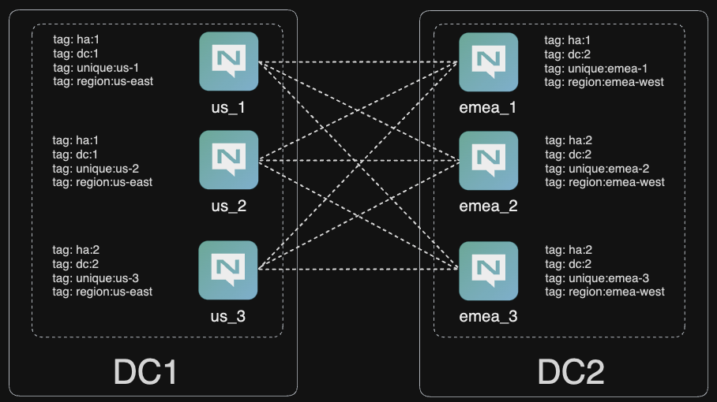
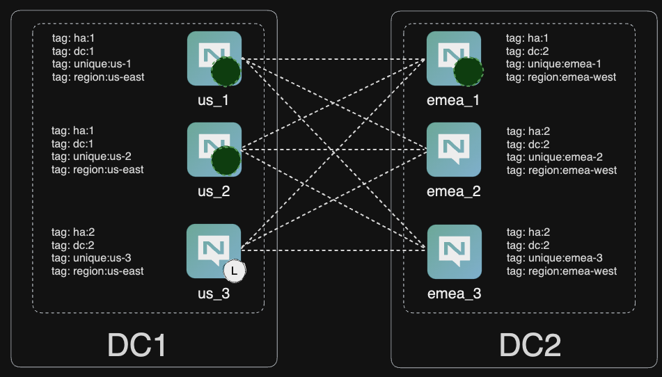

# What is this?

A two data-center cluster, with use of tags to create deterministic placing of streams, enabling 'stretched' R3 streams with processes for catastrophic failure, backup and restore.

Tested on: `nats-server 2.10.4`



### Setup.

For ease and simplicity, I start all nodes in `Kitty` and leave them running in the foreground.

```bash
nats-server -c emea_1.conf
nats-server -c emea_2.conf
nats-server -c emea_3.conf
nats-server -c us_1.conf
nats-server -c us_2.conf
nats-server -c us_3.conf
```

Don't forget to set two contexts up, one for `acc1` and one for `admin`, which is the SYS account. I've called mine `local` and `local:admin` and will use them in this document.

### Validate

The backbone and two leaf-node clusters will come up and each cluster will elect their own meta leader.

```bash
nats server report jetstream --context=local:admin --sort=name      
╭────────────────────────────────────────────────────────────────────────────────────────────────────────╮
│                                            JetStream Summary                                           │
├────────┬─────────┬────────┬─────────┬───────────┬──────────┬───────┬────────┬──────┬─────────┬─────────┤
│ Server │ Cluster │ Domain │ Streams │ Consumers │ Messages │ Bytes │ Memory │ File │ API Req │ API Err │
├────────┼─────────┼────────┼─────────┼───────────┼──────────┼───────┼────────┼──────┼─────────┼─────────┤
│ emea_1 │ STRETCH │ hub    │ 0       │ 0         │ 0        │ 0 B   │ 0 B    │ 0 B  │ 0       │ 0       │
│ emea_2 │ STRETCH │ hub    │ 0       │ 0         │ 0        │ 0 B   │ 0 B    │ 0 B  │ 0       │ 0       │
│ emea_3 │ STRETCH │ hub    │ 0       │ 0         │ 0        │ 0 B   │ 0 B    │ 0 B  │ 0       │ 0       │
│ us_1*  │ STRETCH │ hub    │ 0       │ 0         │ 0        │ 0 B   │ 0 B    │ 0 B  │ 148     │ 74      │
│ us_2   │ STRETCH │ hub    │ 0       │ 0         │ 0        │ 0 B   │ 0 B    │ 0 B  │ 0       │ 0       │
│ us_3   │ STRETCH │ hub    │ 0       │ 0         │ 0        │ 0 B   │ 0 B    │ 0 B  │ 0       │ 0       │
├────────┼─────────┼────────┼─────────┼───────────┼──────────┼───────┼────────┼──────┼─────────┼─────────┤
│        │         │        │ 0       │ 0         │ 0        │ 0 B   │ 0 B    │ 0 B  │ 148     │ 74      │
╰────────┴─────────┴────────┴─────────┴───────────┴──────────┴───────┴────────┴──────┴─────────┴─────────╯

╭──────────────────────────────────────────────────────────────╮
│                  RAFT Meta Group Information                 │
├────────┬──────────┬────────┬─────────┬────────┬────────┬─────┤
│ Name   │ ID       │ Leader │ Current │ Online │ Active │ Lag │
├────────┼──────────┼────────┼─────────┼────────┼────────┼─────┤
│ emea_1 │ h6AdT1CV │        │ true    │ true   │ 440ms  │ 0   │
│ emea_2 │ wxHbsU7o │        │ true    │ true   │ 440ms  │ 0   │
│ emea_3 │ HVb2ZmpZ │        │ true    │ true   │ 440ms  │ 0   │
│ us_1   │ ydtgUGB6 │ yes    │ true    │ true   │ 0s     │ 0   │
│ us_2   │ 43PYYJ4C │        │ true    │ true   │ 440ms  │ 0   │
│ us_3   │ 9uBucVqO │        │ true    │ true   │ 440ms  │ 0   │
╰────────┴──────────┴────────┴─────────┴────────┴────────┴─────╯
```
Now let's add a stream on the tag `ha:1`, which places two nodes in the US and one in EMEA. You can move around the meta leader to the US manually if it isn't automatically selected with the commands below.

```bash
❯ nats stream add --subjects="foo.>" --storage=memory --replicas=3 --retention=limits --tag=ha:1 --defaults foo
Stream foo was created

Information for Stream foo created 2023-11-06 20:47:36

             Subjects: foo.>
             Replicas: 3
              Storage: Memory
       Placement Tags: ha:1

Options:

            Retention: Limits
     Acknowledgments: true
       Discard Policy: Old
     Duplicate Window: 2m0s
    Allows Msg Delete: true
         Allows Purge: true
       Allows Rollups: false

Limits:

     Maximum Messages: unlimited
  Maximum Per Subject: unlimited
        Maximum Bytes: unlimited
          Maximum Age: unlimited
 Maximum Message Size: unlimited
    Maximum Consumers: unlimited

Cluster Information:

                 Name: STRETCH
               Leader: emea_1
              Replica: us_1, current, seen 417µs ago
              Replica: us_2, current, seen 272µs ago

State:

             Messages: 0
                Bytes: 0 B
             FirstSeq: 0
              LastSeq: 0
     Active Consumers: 0
```

Notice here we have the leader in emea, when we want it in the US. Let's move that now.

```bash
nats server raft step-down --context=local:admin
```

The leader moved just as we hoped!

```bash
nats server report jetstream --context=local:admin --sort=name                                                
╭────────────────────────────────────────────────────────────────────────────────────────────────────────╮
│                                            JetStream Summary                                           │
├────────┬─────────┬────────┬─────────┬───────────┬──────────┬───────┬────────┬──────┬─────────┬─────────┤
│ Server │ Cluster │ Domain │ Streams │ Consumers │ Messages │ Bytes │ Memory │ File │ API Req │ API Err │
├────────┼─────────┼────────┼─────────┼───────────┼──────────┼───────┼────────┼──────┼─────────┼─────────┤
│ emea_1 │ STRETCH │ hub    │ 1       │ 0         │ 0        │ 0 B   │ 0 B    │ 0 B  │ 4       │ 1       │
│ emea_2 │ STRETCH │ hub    │ 0       │ 0         │ 0        │ 0 B   │ 0 B    │ 0 B  │ 0       │ 0       │
│ emea_3 │ STRETCH │ hub    │ 0       │ 0         │ 0        │ 0 B   │ 0 B    │ 0 B  │ 0       │ 0       │
│ us_1   │ STRETCH │ hub    │ 1       │ 0         │ 0        │ 0 B   │ 0 B    │ 0 B  │ 0       │ 0       │
│ us_2   │ STRETCH │ hub    │ 1       │ 0         │ 0        │ 0 B   │ 0 B    │ 0 B  │ 0       │ 0       │
│ us_3*  │ STRETCH │ hub    │ 0       │ 0         │ 0        │ 0 B   │ 0 B    │ 0 B  │ 0       │ 0       │
├────────┼─────────┼────────┼─────────┼───────────┼──────────┼───────┼────────┼──────┼─────────┼─────────┤
│        │         │        │ 3       │ 0         │ 0        │ 0 B   │ 0 B    │ 0 B  │ 4       │ 1       │
╰────────┴─────────┴────────┴─────────┴───────────┴──────────┴───────┴────────┴──────┴─────────┴─────────╯

╭──────────────────────────────────────────────────────────────╮
│                  RAFT Meta Group Information                 │
├────────┬──────────┬────────┬─────────┬────────┬────────┬─────┤
│ Name   │ ID       │ Leader │ Current │ Online │ Active │ Lag │
├────────┼──────────┼────────┼─────────┼────────┼────────┼─────┤
│ emea_1 │ h6AdT1CV │        │ true    │ true   │ 180ms  │ 0   │
│ emea_2 │ wxHbsU7o │        │ true    │ true   │ 180ms  │ 0   │
│ emea_3 │ HVb2ZmpZ │        │ true    │ true   │ 180ms  │ 0   │
│ us_1   │ ydtgUGB6 │        │ true    │ true   │ 180ms  │ 0   │
│ us_2   │ 43PYYJ4C │        │ true    │ true   │ 180ms  │ 0   │
│ us_3   │ 9uBucVqO │ yes    │ true    │ true   │ 0s     │ 0   │
╰────────┴──────────┴────────┴─────────┴────────┴────────┴─────╯
```

This is how our setup currently looks, with a stream (represented by the green circles) in the `ha:1` group of nodes with meta leadership in the US.



Now, let's put some data in to the stream.

```bash
nats pub foo.1 "test1"
nats pub foo.2 "test2"
nats pub foo.3 "test3"
nats pub foo.4 "test4"
nats pub foo.5 "test5"
nats stream view foo --raw
```

At this point, we have a strategically placed R3 stream spanning two data centers. Now, let's take down the US region, by killing the nodes. Issue `ctrl+c` on the US nodes and let's watch what happens. Ensure that your nats context has the connectivity details ready for a node in emea, else you might miss what happens. Ensure that you kill the current meta leader last, in the case of this example that is `us_3`.

```bash
nats server report jetstream --context=local:admin --sort=name
╭────────────────────────────────────────────────────────────────────────────────────────────────────────╮
│                                            JetStream Summary                                           │
├────────┬─────────┬────────┬─────────┬───────────┬──────────┬───────┬────────┬──────┬─────────┬─────────┤
│ Server │ Cluster │ Domain │ Streams │ Consumers │ Messages │ Bytes │ Memory │ File │ API Req │ API Err │
├────────┼─────────┼────────┼─────────┼───────────┼──────────┼───────┼────────┼──────┼─────────┼─────────┤
│ emea_1 │ STRETCH │ hub    │ 1       │ 0         │ 5        │ 130 B │ 130 B  │ 0 B  │ 9,925   │ 2,550   │
│ emea_2 │ STRETCH │ hub    │ 0       │ 0         │ 0        │ 130 B │ 130 B  │ 0 B  │ 6,882   │ 6,653   │
│ emea_3 │ STRETCH │ hub    │ 0       │ 0         │ 0        │ 130 B │ 130 B  │ 0 B  │ 6,361   │ 5,747   │
├────────┼─────────┼────────┼─────────┼───────────┼──────────┼───────┼────────┼──────┼─────────┼─────────┤
│        │         │        │ 3       │ 0         │ 15       │ 390 B │ 390 B  │ 0 B  │ 23,168  │ 14,950  │
╰────────┴─────────┴────────┴─────────┴───────────┴──────────┴───────┴────────┴──────┴─────────┴─────────╯


WARNING: No cluster meta leader found. The cluster expects 6 nodes but only 3 responded. JetStream operation require at least 4 up nodes.
```

So, we're now in a position without quorum, but fear not. Providing you have a small node, we can recover the meta state and bring back the cluster, even in the event of a total failure like this. 

First, let's create a config file of an arbiter node, or a loose term for a useful node!

```bash
server_name: "emea_4"
server_tags: ["region:emea-west", "unique:emea-4", "dc:nope", "ha:nope"]

listen: "0.0.0.0:4226"

http_port: 8226

http_base_path: "/nats/dashboard"

cluster: {
	name: STRETCH
	listen: 0.0.0.0:4246
	routes: ["nats://127.0.0.1:4240", "nats://127.0.0.1:4241", "nats://127.0.0.1:4242", "nats://127.0.0.1:4243", "nats://127.0.0.1:4244"]
}

jetstream: {
        unique_tag="unique:"
        domain=hub
        store="./emea_4"
}

include ./accounts.conf
```

Now stand this node up. What you should see is a meta leadership state become live.

```bash
nats server report jetstream --context=local:admin --sort=name
╭─────────────────────────────────────────────────────────────────────────────────────────────────────────╮
│                                            JetStream Summary                                            │
├─────────┬─────────┬────────┬─────────┬───────────┬──────────┬───────┬────────┬──────┬─────────┬─────────┤
│ Server  │ Cluster │ Domain │ Streams │ Consumers │ Messages │ Bytes │ Memory │ File │ API Req │ API Err │
├─────────┼─────────┼────────┼─────────┼───────────┼──────────┼───────┼────────┼──────┼─────────┼─────────┤
│ emea_1  │ STRETCH │ hub    │ 1       │ 0         │ 5        │ 130 B │ 130 B  │ 0 B  │ 13,025  │ 3,570   │
│ emea_2  │ STRETCH │ hub    │ 1       │ 0         │ 5        │ 130 B │ 130 B  │ 0 B  │ 9,950   │ 9,721   │
│ emea_3* │ STRETCH │ hub    │ 1       │ 0         │ 5        │ 130 B │ 130 B  │ 0 B  │ 9,354   │ 8,720   │
│ emea_4  │ STRETCH │ hub    │ 0       │ 0         │ 0        │ 0 B   │ 0 B    │ 0 B  │ 0       │ 0       │
├─────────┼─────────┼────────┼─────────┼───────────┼──────────┼───────┼────────┼──────┼─────────┼─────────┤
│         │         │        │ 3       │ 0         │ 15       │ 390 B │ 390 B  │ 0 B  │ 32,329  │ 22,011  │
╰─────────┴─────────┴────────┴─────────┴───────────┴──────────┴───────┴────────┴──────┴─────────┴─────────╯

╭──────────────────────────────────────────────────────────────╮
│                  RAFT Meta Group Information                 │
├────────┬──────────┬────────┬─────────┬────────┬────────┬─────┤
│ Name   │ ID       │ Leader │ Current │ Online │ Active │ Lag │
├────────┼──────────┼────────┼─────────┼────────┼────────┼─────┤
│ emea_1 │ h6AdT1CV │        │ true    │ true   │ 605ms  │ 0   │
│ emea_2 │ wxHbsU7o │        │ true    │ true   │ 605ms  │ 0   │
│ emea_3 │ HVb2ZmpZ │ yes    │ true    │ true   │ 0s     │ 0   │
│ emea_4 │ wldoW7tT │        │ true    │ true   │ 605ms  │ 0   │
│ us_1   │ ydtgUGB6 │        │ false   │ false  │ 9m29s  │ 15  │
│ us_2   │ 43PYYJ4C │        │ false   │ false  │ 9m38s  │ 15  │
│ us_3   │ 9uBucVqO │        │ false   │ false  │ 9m38s  │ 15  │
╰────────┴──────────┴────────┴─────────┴────────┴────────┴─────╯
```

Great, now let's move the entire stream over to `dc:2`, by editing the stream here like so:

```bash
nats str edit --tag=dc:2 foo -f

# Check the streams, messages and bytes look correct (or mirror that of emea_1 at the time of failure
nats server report jetstream --context=local:admin --sort=name                                               
╭─────────────────────────────────────────────────────────────────────────────────────────────────────────╮
│                                            JetStream Summary                                            │
├─────────┬─────────┬────────┬─────────┬───────────┬──────────┬───────┬────────┬──────┬─────────┬─────────┤
│ Server  │ Cluster │ Domain │ Streams │ Consumers │ Messages │ Bytes │ Memory │ File │ API Req │ API Err │
├─────────┼─────────┼────────┼─────────┼───────────┼──────────┼───────┼────────┼──────┼─────────┼─────────┤
│ emea_1  │ STRETCH │ hub    │ 1       │ 0         │ 5        │ 130 B │ 130 B  │ 0 B  │ 2,120   │ 116     │
│ emea_2  │ STRETCH │ hub    │ 1       │ 0         │ 5        │ 130 B │ 130 B  │ 0 B  │ 0       │ 0       │
│ emea_3* │ STRETCH │ hub    │ 1       │ 0         │ 5        │ 130 B │ 130 B  │ 0 B  │ 361     │ 0       │
│ emea_4  │ STRETCH │ hub    │ 0       │ 0         │ 0        │ 0 B   │ 0 B    │ 0 B  │ 0       │ 0       │
├─────────┼─────────┼────────┼─────────┼───────────┼──────────┼───────┼────────┼──────┼─────────┼─────────┤
│         │         │        │ 3       │ 0         │ 15       │ 390 B │ 390 B  │ 0 B  │ 2,481   │ 116     │
╰─────────┴─────────┴────────┴─────────┴───────────┴──────────┴───────┴────────┴──────┴─────────┴─────────╯

╭──────────────────────────────────────────────────────────────╮
│                  RAFT Meta Group Information                 │
├────────┬──────────┬────────┬─────────┬────────┬────────┬─────┤
│ Name   │ ID       │ Leader │ Current │ Online │ Active │ Lag │
├────────┼──────────┼────────┼─────────┼────────┼────────┼─────┤
│ emea_1 │ h6AdT1CV │        │ true    │ true   │ 980ms  │ 0   │
│ emea_2 │ wxHbsU7o │        │ true    │ true   │ 980ms  │ 0   │
│ emea_3 │ HVb2ZmpZ │ yes    │ true    │ true   │ 0s     │ 0   │
│ emea_4 │ wldoW7tT │        │ true    │ true   │ 981ms  │ 0   │
│ us_1   │ ydtgUGB6 │        │ false   │ false  │ 2m40s  │ 22  │
│ us_2   │ 43PYYJ4C │        │ false   │ false  │ 1m11s  │ 22  │
│ us_3   │ 9uBucVqO │        │ false   │ false  │ 2m40s  │ 22  │
╰────────┴──────────┴────────┴─────────┴────────┴────────┴─────╯)
```

You will see the stream copy across to the nodes and once you see the same number of messages and bytes, you can evict the offline nodes.

Now let's evict the `us_x` nodes and the `emea_4` node out of the meta RAFT group.

__WARNING__: This is a lab exercise, do not do this in production unless you know what this will do. Not a time for copy pasta!

```bash
nats server raft peer-remove us_1 --context=local:admin -f
nats server raft peer-remove us_2 --context=local:admin -f
nats server raft peer-remove us_3 --context=local:admin -f
```

Providing that the `emea_4` node isn't the meta leader, let's kill it and remove it as well.

```bash
# Kill emea_4
nats server raft peer-remove emea_4 --context=local:admin -f

# Show the RAFT status
nats server report jetstream --context=local:admin --sort=name
╭─────────────────────────────────────────────────────────────────────────────────────────────────────────╮
│                                            JetStream Summary                                            │
├─────────┬─────────┬────────┬─────────┬───────────┬──────────┬───────┬────────┬──────┬─────────┬─────────┤
│ Server  │ Cluster │ Domain │ Streams │ Consumers │ Messages │ Bytes │ Memory │ File │ API Req │ API Err │
├─────────┼─────────┼────────┼─────────┼───────────┼──────────┼───────┼────────┼──────┼─────────┼─────────┤
│ emea_1  │ STRETCH │ hub    │ 1       │ 0         │ 5        │ 130 B │ 130 B  │ 0 B  │ 15,409  │ 3,570   │
│ emea_2  │ STRETCH │ hub    │ 1       │ 0         │ 5        │ 130 B │ 130 B  │ 0 B  │ 9,950   │ 9,721   │
│ emea_3* │ STRETCH │ hub    │ 1       │ 0         │ 5        │ 130 B │ 130 B  │ 0 B  │ 10,546  │ 8,720   │
├─────────┼─────────┼────────┼─────────┼───────────┼──────────┼───────┼────────┼──────┼─────────┼─────────┤
│         │         │        │ 3       │ 0         │ 15       │ 390 B │ 390 B  │ 0 B  │ 35,905  │ 22,011  │
╰─────────┴─────────┴────────┴─────────┴───────────┴──────────┴───────┴────────┴──────┴─────────┴─────────╯

╭──────────────────────────────────────────────────────────────╮
│                  RAFT Meta Group Information                 │
├────────┬──────────┬────────┬─────────┬────────┬────────┬─────┤
│ Name   │ ID       │ Leader │ Current │ Online │ Active │ Lag │
├────────┼──────────┼────────┼─────────┼────────┼────────┼─────┤
│ emea_1 │ h6AdT1CV │        │ true    │ true   │ 998ms  │ 0   │
│ emea_2 │ wxHbsU7o │        │ true    │ true   │ 998ms  │ 0   │
│ emea_3 │ HVb2ZmpZ │ yes    │ true    │ true   │ 0s     │ 0   │
╰────────┴──────────┴────────┴─────────┴────────┴────────┴─────╯
```

A manual recovery, but in the face of full failure from a six node cluster and a catastrophic ordered failure scenario, we have a recoverable path.

### Can we restore?

From a catastrophic data center failure, we'll need to rename the US servers, but yes, we can fully restore a working system.

Let's call our US servers: `us_1.1, us_2.1` and `us_3.1`, delete their JetStream files and bring the nodes back-online. We're deleting the data here because we're emulating a catastrophic loss of a cluster. We could also do with changing some IP addresses in our config files and slowly reloading them, but I'll leave that to you.

Now let's re-introduce the US nodes, with new names and the removal of their JetStream data.

```bash
nats server report jetstream --context=local:admin --sort=name
╭─────────────────────────────────────────────────────────────────────────────────────────────────────────╮
│                                            JetStream Summary                                            │
├─────────┬─────────┬────────┬─────────┬───────────┬──────────┬───────┬────────┬──────┬─────────┬─────────┤
│ Server  │ Cluster │ Domain │ Streams │ Consumers │ Messages │ Bytes │ Memory │ File │ API Req │ API Err │
├─────────┼─────────┼────────┼─────────┼───────────┼──────────┼───────┼────────┼──────┼─────────┼─────────┤
│ emea_1* │ STRETCH │ hub    │ 1       │ 0         │ 5        │ 130 B │ 130 B  │ 0 B  │ 14,049  │ 116     │
│ emea_2  │ STRETCH │ hub    │ 0       │ 0         │ 0        │ 0 B   │ 0 B    │ 0 B  │ 87      │ 0       │
│ emea_3  │ STRETCH │ hub    │ 0       │ 0         │ 0        │ 0 B   │ 0 B    │ 0 B  │ 3,266   │ 2       │
│ us_1.1  │ STRETCH │ hub    │ 1       │ 0         │ 5        │ 130 B │ 130 B  │ 0 B  │ 0       │ 0       │
│ us_2.1  │ STRETCH │ hub    │ 1       │ 0         │ 5        │ 130 B │ 130 B  │ 0 B  │ 0       │ 0       │
│ us_3.1  │ STRETCH │ hub    │ 0       │ 0         │ 0        │ 0 B   │ 0 B    │ 0 B  │ 0       │ 0       │
├─────────┼─────────┼────────┼─────────┼───────────┼──────────┼───────┼────────┼──────┼─────────┼─────────┤
│         │         │        │ 3       │ 0         │ 15       │ 390 B │ 390 B  │ 0 B  │ 17,402  │ 118     │
╰─────────┴─────────┴────────┴─────────┴───────────┴──────────┴───────┴────────┴──────┴─────────┴─────────╯

╭──────────────────────────────────────────────────────────────╮
│                  RAFT Meta Group Information                 │
├────────┬──────────┬────────┬─────────┬────────┬────────┬─────┤
│ Name   │ ID       │ Leader │ Current │ Online │ Active │ Lag │
├────────┼──────────┼────────┼─────────┼────────┼────────┼─────┤
│ emea_1 │ h6AdT1CV │ yes    │ true    │ true   │ 0s     │ 0   │
│ emea_2 │ wxHbsU7o │        │ true    │ true   │ 914ms  │ 0   │
│ emea_3 │ HVb2ZmpZ │        │ true    │ true   │ 914ms  │ 0   │
│ us_1.1 │ BDQPl4dy │        │ true    │ true   │ 914ms  │ 0   │
│ us_2.1 │ Zvkksk88 │        │ true    │ true   │ 914ms  │ 0   │
│ us_3.1 │ HEJG5ObD │        │ true    │ true   │ 914ms  │ 0   │
╰────────┴──────────┴────────┴─────────┴────────┴────────┴─────╯
╰────────┴──────────┴────────┴─────────┴────────┴────────┴─────╯
```

Like magic, the nodes rejoin. Now, we can restore functionality back to the US with the HA backup node of the R3 in EMEA. The group `ha:1` has two nodes in the US and one node in EMEA, within the six node functioning cluster.

```bash
nats str edit --tag="ha:1" foo -f

# Restore RAFT leadership to the US. Repeat the below until leadership moves.
nats server raft step-down --context=local:admin

nats server report jetstream --context=local:admin --sort=name
╭─────────────────────────────────────────────────────────────────────────────────────────────────────────╮
│                                            JetStream Summary                                            │
├─────────┬─────────┬────────┬─────────┬───────────┬──────────┬───────┬────────┬──────┬─────────┬─────────┤
│ Server  │ Cluster │ Domain │ Streams │ Consumers │ Messages │ Bytes │ Memory │ File │ API Req │ API Err │
├─────────┼─────────┼────────┼─────────┼───────────┼──────────┼───────┼────────┼──────┼─────────┼─────────┤
│ emea_1  │ STRETCH │ hub    │ 1       │ 0         │ 5        │ 130 B │ 130 B  │ 0 B  │ 15,250  │ 116     │
│ emea_2  │ STRETCH │ hub    │ 0       │ 0         │ 0        │ 0 B   │ 0 B    │ 0 B  │ 105     │ 1       │
│ emea_3  │ STRETCH │ hub    │ 0       │ 0         │ 0        │ 0 B   │ 0 B    │ 0 B  │ 3,266   │ 2       │
│ us_1.1  │ STRETCH │ hub    │ 1       │ 0         │ 5        │ 130 B │ 130 B  │ 0 B  │ 0       │ 0       │
│ us_2.1* │ STRETCH │ hub    │ 1       │ 0         │ 5        │ 130 B │ 130 B  │ 0 B  │ 87      │ 0       │
│ us_3.1  │ STRETCH │ hub    │ 0       │ 0         │ 0        │ 0 B   │ 0 B    │ 0 B  │ 0       │ 0       │
├─────────┼─────────┼────────┼─────────┼───────────┼──────────┼───────┼────────┼──────┼─────────┼─────────┤
│         │         │        │ 3       │ 0         │ 15       │ 390 B │ 390 B  │ 0 B  │ 18,708  │ 119     │
╰─────────┴─────────┴────────┴─────────┴───────────┴──────────┴───────┴────────┴──────┴─────────┴─────────╯

╭──────────────────────────────────────────────────────────────╮
│                  RAFT Meta Group Information                 │
├────────┬──────────┬────────┬─────────┬────────┬────────┬─────┤
│ Name   │ ID       │ Leader │ Current │ Online │ Active │ Lag │
├────────┼──────────┼────────┼─────────┼────────┼────────┼─────┤
│ emea_1 │ h6AdT1CV │        │ true    │ true   │ 663ms  │ 0   │
│ emea_2 │ wxHbsU7o │        │ true    │ true   │ 663ms  │ 0   │
│ emea_3 │ HVb2ZmpZ │        │ true    │ true   │ 663ms  │ 0   │
│ us_1.1 │ BDQPl4dy │        │ true    │ true   │ 663ms  │ 0   │
│ us_2.1 │ Zvkksk88 │ yes    │ true    │ true   │ 0s     │ 0   │
│ us_3.1 │ HEJG5ObD │        │ true    │ true   │ 663ms  │ 0   │
╰────────┴──────────┴────────┴─────────┴────────┴────────┴─────╯
```

Et voila. Finished.

### What if we didn't delete the JetStream data for the US nodes?

This exercise emulated a catastrophic data center failure and recovery. We deleted the data because we're pretending it's gone.

### What if this was a temporary loss, but we needed temporary quorum?

Then don't evict the nodes when introducing the arbiter node. So don't run these commands!

```bash
nats server raft peer-remove us_1 --context=local:admin -f
nats server raft peer-remove us_2 --context=local:admin -f
nats server raft peer-remove us_3 --context=local:admin -f
```

When the cluster comes back, you can simply take down `emea_4` and evict that to return to normal.

### Useful?

Good! We could have also shrunk the replcation of the stream to R1, but that wouldn't have helped our RAFT cluster shifting from six nodes to three and losing RAFT meta group leadership. 

Because of the placement tags, you will not be able to remap a failed node in the three node tag set, but you can reconfigure another server with the tag and reload it.

### Useful Links
[https://docs.nats.io/running-a-nats-service/configuration/clustering/jetstream_clustering/administration](https://docs.nats.io/running-a-nats-service/configuration/clustering/jetstream_clustering/administration)

[https://docs.nats.io/running-a-nats-service/configuration/clustering/jetstream_clustering/administration](https://docs.nats.io/running-a-nats-service/configuration/clustering/jetstream_clustering/administration)

[https://docs.nats.io/running-a-nats-service/nats_admin/jetstream_admin/streams](https://docs.nats.io/running-a-nats-service/nats_admin/jetstream_admin/streams)

[https://docs.nats.io/running-a-nats-service/nats_admin/jetstream_admin/disaster_recovery](https://docs.nats.io/running-a-nats-service/nats_admin/jetstream_admin/disaster_recovery)

[https://docs.nats.io/nats-concepts/jetstream/streams#placement](https://docs.nats.io/nats-concepts/jetstream/streams#placement)


### Required Enhancements

1.  Re-introduce a node's RAFT membership after previously removing it. Might be the same as below.
2.  Remove traces of nodes previously from the meta group (my example of `us_1` -> `us_1.1` etc).
2.  If we use placement tags for a stream and say only two our of three are available, we need a fall-back tag like a region for the third.