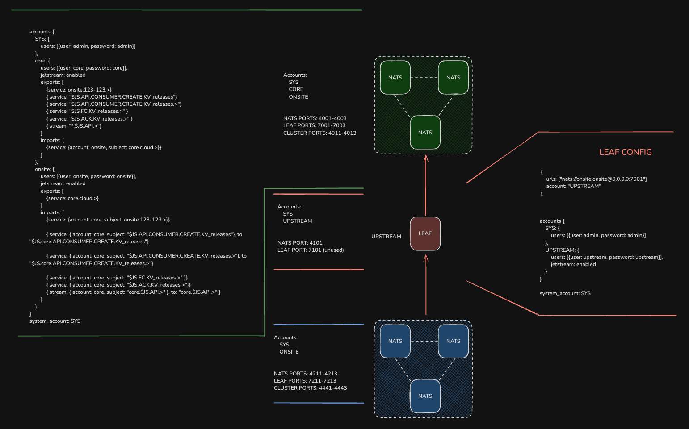

# README

This is another fun one. Similar to the dual remote leaf example (also in this repo).

A leaf node acts as a bridge between two clusters, however, the leaf is cascaced, meaning it's remoted to a northbound cluster and accepts leaf node connections on it's southbound interface.

The leaf node has transitive properties, but only initiates one connection and receives other connections.

You'll need the NATS server binary and the latest NATS CLI. Create some contexts, one for the green, one for blue and one for both red accounts.

The account layout is important.

__GREEN__
CORE account is only on green.
ONSITE account is the downstream account for the leaf node to bind to.

__RED__
UPSTREAM binds to the green ONSITE account.

__BLUE__
ONSITE account is the site local account.
Binds ONSITE to UPSTREAM on red via credentials.

The behaviour mimics one of shared services etc, where an onsite account can publish to subjects that appear on a central services system.
But, such a system should not be easily violated regarding its security posture.
Also, the ONSITE account should be able to receive some messages from the CORE account in the shared services account. This could be for software upgrade reasons, fleet management etc.

The leaf node here acts as a form of 'break glass' and isolation between both clusters, but unlike dual remotes, does not require additional imports and exports on the leaf config. The green cluster takes care of everything. The leaf acts as a transparent bridge.

The only downside with this model is the number of connections hittin the leaf node and if that goes offline, the logs will be spammed. Also, the leaf acts purely as a bridge, with no further isolation of accounts or subjects via imports and exports. At least with the dual remote, there is the additional protection layer, but at the cost of the complexity of understanding what's going on!

### Requirements

__core.cloud.>__
1. Publishes made on green on `core.cloud.>` can be subscribed to in blue
Note, any other service can publish to `core.cloud.>` to the red accounts or blue.

2. Publishes made on red or blue to `core.cloud.>` are ignored by green

Lockdown connection credentials for further security.

__onsite.123-123.>__
1. Publishes made on blue to `onsite.123-123.>` can be subscribed to by red (UPSTREAM & DOWNSTREAM) and green
2. Publishes made on green and red[UPSTREAM] are ignored by blue

Lockdown connection credentials for further security.