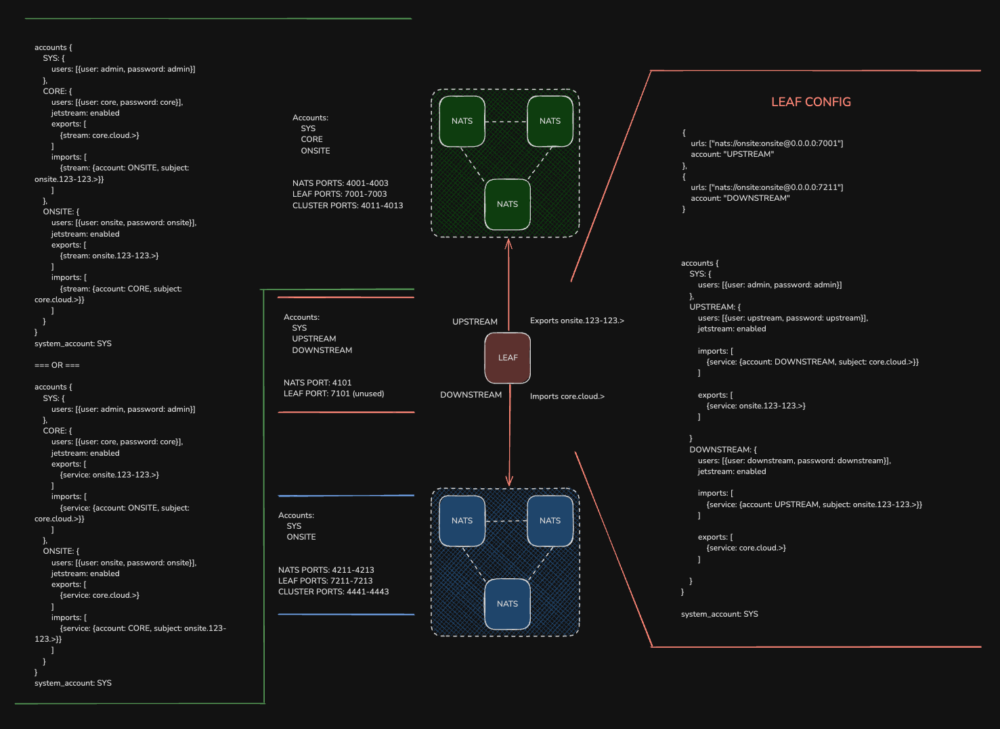

# README

This is a fun one!

A leaf node acting as a bridge, between two three-node clusters

This means that each cluster is leaf-noded into as a remote and the leaf node has transitive properties.

Imports and exports make your brain hurt because of the directionality. Diagram below illustrated the boundings.

You'll need the NATS server binary and the latest NATS CLI. Create some contexts, one for the green, one for blue and one for both red accounts.

The account layout is important.

__GREEN__
CORE account is only on green.
ONSITE account is the downstream account for the leaf node to bind to.

__RED__
UPSTREAM binds to the green ONSITE account.
DOWNSTREAM binds to the blue's ONSITE account.

__BLUE__
ONSITE account is the site local account.

The behaviour mimics one of shared services etc, where an onsite account can publish to subjects that appear on a central services system.
But, such a system should not be easily violated regarding its security posture.
Also, the ONSITE account should be able to receive some messages from the CORE account in the shared services account. This could be for software upgrade reasons, fleet management etc.

The leaf node here acts as a form of 'break glass' and isolation. This could sit in a DMZ somewhere and would satisfy PCI-DSS requirements for a break-glass solution, with the leaf initiating connections both outbound and deeper into the network, towards the blue cluster.

### Requirements

__core.cloud.>__
1. Publishes made on green on `core.cloud.>` can be subscribed to in blue
Note, any other service can publish to `core.cloud.>` to the red accounts or blue.

2. Publishes made on red or blue to `core.cloud.>` are ignored by green

Lockdown connection credentials for further security.

__onsite.123-123.>__
1. Publishes made on blue to `onsite.123-123.>` can be subscribed to by red (UPSTREAM & DOWNSTREAM) and green
2. Publishes made on green and red[UPSTREAM] are ignored by blue

Lockdown connection credentials for further security.