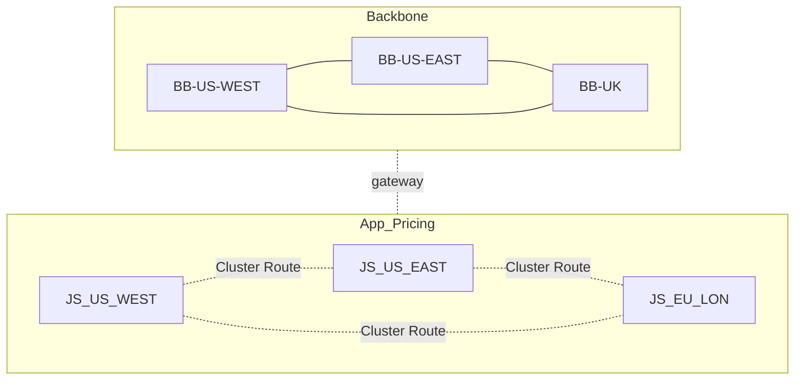

# README

These configurations are for decentralised auth with a stateless backbone and stateful edge.

### Explanation
This topology is a set of layers.

[Y] One outcome is for the JS enabled clusters to communicate with backbone producers and consumers over gateway connections.

[Y] A goal is for a stateful JS cluster to be provisioned without any configuration changes to the backbone.

[Y] A security team can manage credentials and therefore access to all NATS clusters, whether stateless or stateful.
